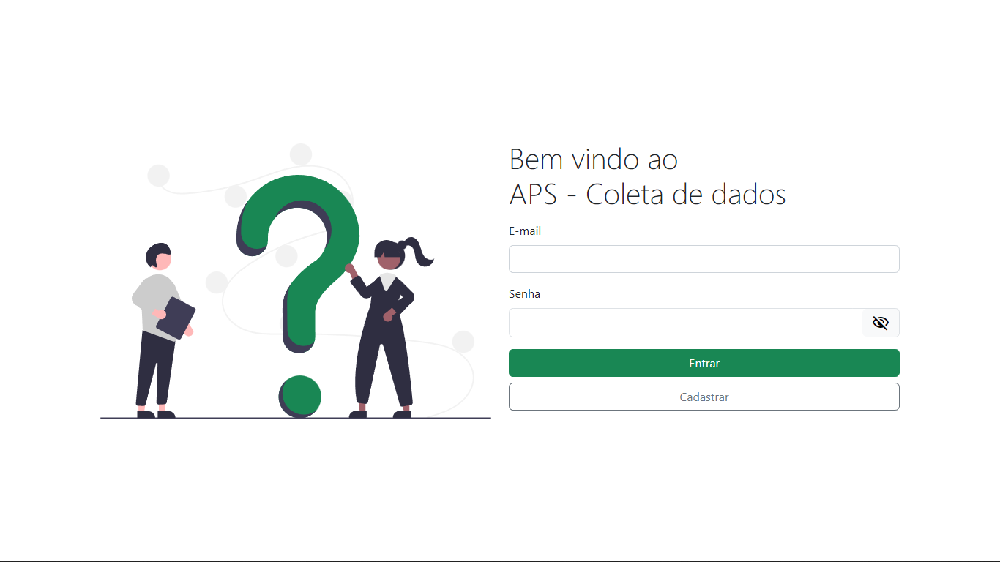

  <h1>Aps - Coleta de dados</h1>

  <a href="#-tecnologias">Tecnologias</a>&nbsp;&nbsp;&nbsp;|&nbsp;&nbsp;&nbsp;
  <a href="#-projeto">Projeto</a>&nbsp;&nbsp;&nbsp;|&nbsp;&nbsp;&nbsp;

 

  

## 🚀 Tecnologias

Esse projeto foi desenvolvido com as seguintes tecnologias:

- ReactJs
- NodeJs
- Typescript
- MongoDB Atlas
- Prisma
- Express
- Jsonwebtoken
- Axios

## 💻 Projeto

O Aps - Coleta de dados é uma aplicação que tem como objetivo agrupar as principais dúvidas dos discentes de uma instituição de ensino superior.

---

Feito com ♥ by Lincoln silva :wave:

- [Instagram](https://www.instagram.com/jotalincoln/)
- [Github](https://github.com/LincolnSA)
- [Portfólio](https://lincolnsa.github.io/portfolio/)
- [devlincolnsilva@gmail.com](mailto:devlincolnsilva@gmail.com?subject=Oi%20lincoln)
